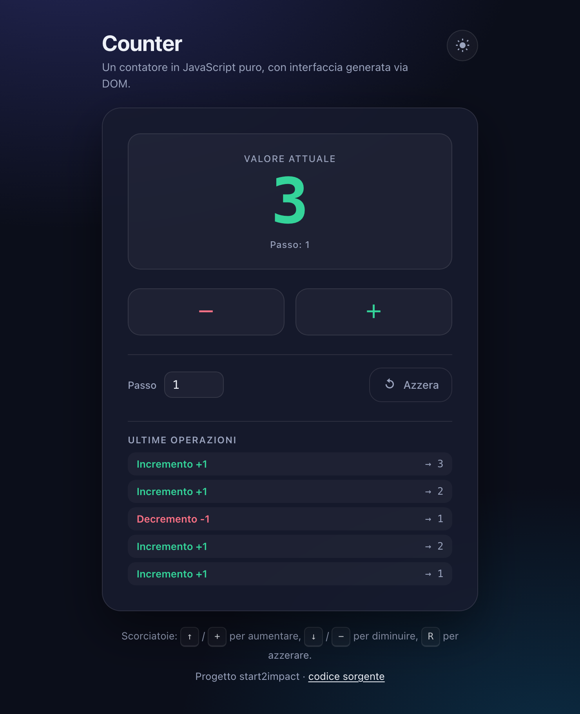
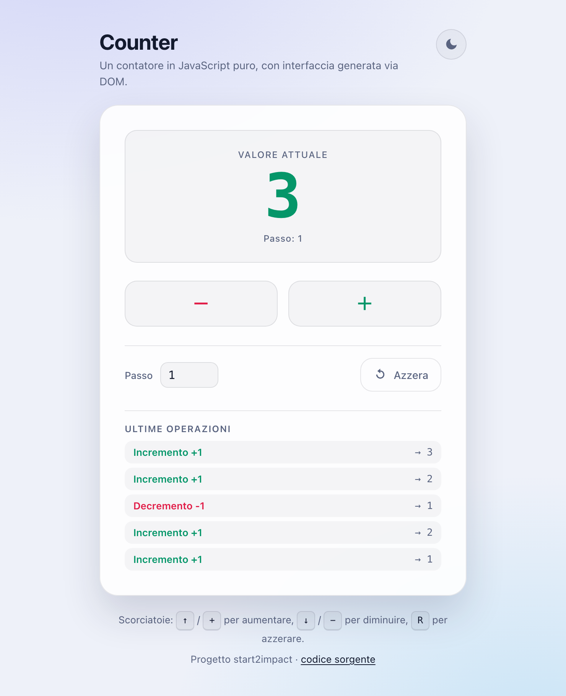

<div align="center">

# 🔢 Counter

**Un contatore web in JavaScript puro, con interfaccia costruita interamente via DOM.**

[](https://turbor93.github.io/JavaScript_RiccardoB/)
&nbsp;
[](LICENSE)


### 👉 [**turbor93.github.io/JavaScript_RiccardoB**](https://turbor93.github.io/JavaScript_RiccardoB/) 👈

</div>

---

## 📑 Indice

- [Il progetto](#-il-progetto)
- [Anteprima](#-anteprima)
- [Funzionalità](#-funzionalità)
- [Requisiti del progetto e come sono stati soddisfatti](#-requisiti-del-progetto-e-come-sono-stati-soddisfatti)
- [Struttura del repository](#-struttura-del-repository)
- [Come funziona](#-come-funziona)
- [Eseguire il progetto in locale](#-eseguire-il-progetto-in-locale)
- [Test](#-test)
- [Accessibilità](#-accessibilità)
- [Compatibilità](#-compatibilità)
- [Tecnologie](#-tecnologie)
- [Autore](#-autore)
- [Licenza](#-licenza)

---

## 🎯 Il progetto

**Counter** è una piccola applicazione web che simula il comportamento di un contatore:
si apre su un valore iniziale di `0` e permette di aumentarlo o diminuirlo con due
pulsanti, **+** e **−**.

È il progetto finale del modulo **JavaScript** del corso
[start2impact](https://www.start2impact.it/). La consegna chiede espressamente che
l'interfaccia non sia scritta a mano nell'HTML, ma **generata dinamicamente da
JavaScript tramite manipolazione del DOM**: il file [index.html](index.html) contiene
soltanto un contenitore vuoto, tutto il resto nasce da `document.createElement`.

Oltre ai requisiti minimi, l'applicazione aggiunge alcune funzionalità pensate per
renderla davvero utilizzabile: passo personalizzabile, salvataggio automatico,
scorciatoie da tastiera, tema chiaro/scuro e uno storico delle ultime operazioni.

---

## 🖼 Anteprima

| Tema scuro | Tema chiaro |
| :---: | :---: |
|  |  |

---

## ✨ Funzionalità

### Richieste dalla consegna

| | Funzionalità |
| :---: | :--- |
| ✅ | Il contatore parte da **0** all'apertura della pagina |
| ✅ | Pulsante **+** per incrementare |
| ✅ | Pulsante **−** per decrementare |
| ✅ | Il valore corrente è sempre visibile a schermo |
| ✅ | Interfaccia creata **dinamicamente** via DOM |

### Aggiunte

| | Funzionalità | Dettaglio |
| :---: | :--- | :--- |
| 🔢 | **Passo personalizzabile** | si sceglie di quanto incrementare o decrementare a ogni click (da 1 a 1000) |
| 💾 | **Salvataggio automatico** | valore, passo e tema vengono ricordati alla riapertura della pagina, tramite `localStorage` |
| ⌨️ | **Scorciatoie da tastiera** | <kbd>↑</kbd> / <kbd>+</kbd> per aumentare, <kbd>↓</kbd> / <kbd>−</kbd> per diminuire, <kbd>R</kbd> per azzerare |
| 🕘 | **Storico** | le ultime 5 operazioni, con la variazione applicata e il valore risultante |
| 🌗 | **Tema chiaro / scuro** | al primo avvio segue la preferenza del sistema operativo, poi ricorda la scelta |
| 🎨 | **Feedback visivo** | il numero è verde se positivo, rosso se negativo, con una breve animazione a ogni cambio |
| 🚧 | **Limiti** | il valore resta tra −999999 e 999999; al limite il pulsante corrispondente si disabilita |
| ♿️ | **Accessibile** | navigabile da tastiera, etichette ARIA e annuncio del nuovo valore agli screen reader |
| 📱 | **Responsive** | layout leggibile da smartphone a desktop |
| 🧪 | **Testata** | 20 test automatici sulla logica, eseguibili con Node senza installare nulla |

---

## 📋 Requisiti del progetto e come sono stati soddisfatti

| Requisito | Come è stato rispettato |
| :--- | :--- |
| Sviluppo **esclusivamente in JavaScript puro** | Nessun transpiler, nessun build step: si aprono i file e funzionano |
| Interfaccia **creata dinamicamente via DOM** | [index.html](index.html) contiene solo `<div id="app"></div>`; display, pulsanti, campi e storico sono creati in [js/ui.js](js/ui.js) con `document.createElement` |
| **Niente jQuery**, React, Angular, Vue o simili | Zero dipendenze: nessun `package.json`, nessun `node_modules`, nessuno script da CDN |
| Librerie esterne solo se necessarie | Non ne è servita nessuna, nemmeno per le icone: sono SVG scritti a mano |
| Funzionalità aggiuntive a piacere | Vedi la tabella qui sopra |

---

## 📁 Struttura del repository

```
JavaScript_RiccardoB/
│
├── index.html              # Contenitore vuoto + inclusione degli script
│
├── css/
│   └── style.css           # Stili, temi chiaro/scuro, animazioni, responsive
│
├── js/
│   ├── storage.js          # Salvataggio su localStorage (a prova di errore)
│   ├── counter.js          # Logica del contatore, indipendente dal DOM
│   ├── ui.js               # Creazione dell'interfaccia e rendering
│   └── app.js              # Punto di ingresso: eventi, tastiera, tema, storico
│
├── tests/
│   └── counter.test.js     # Test della logica, eseguibili con Node
│
├── assets/
│   ├── screenshot-dark.png
│   └── screenshot-light.png
│
├── LICENSE
└── README.md
```

---

## ⚙️ Come funziona

Il codice è diviso in quattro file con responsabilità separate, così che ognuno
faccia una cosa sola e sia comprensibile da solo.

```
   ┌──────────────┐   crea e aggiorna   ┌──────────────┐
   │   ui.js      │◀────────────────────│   app.js     │
   │  (il DOM)    │                     │(orchestrazione)│
   └──────────────┘                     └──────┬───────┘
                                               │ chiama i metodi
                                               ▼
   ┌──────────────┐   notifica i cambi  ┌──────────────┐
   │  storage.js  │◀────────────────────│  counter.js  │
   │(localStorage)│                     │ (la logica)  │
   └──────────────┘                     └──────────────┘
```

**`counter.js` — la logica.** Espone una factory `createCounter()` che restituisce
un contatore con lo stato chiuso in una *closure*: dall'esterno non è modificabile
se non attraverso i metodi `increment()`, `decrement()`, `reset()`, `setStep()` e
`setValue()`. Ogni cambiamento viene comunicato ai sottoscrittori registrati con
`subscribe()`, in stile *observer*.

Questo modulo **non conosce il DOM**: è la ragione per cui può essere testato in
Node senza un browser, e per cui l'interfaccia potrebbe essere riscritta da zero
senza toccarlo.

**`ui.js` — l'interfaccia.** Costruisce tutti gli elementi con `document.createElement`
(tramite un piccolo helper dichiarativo `el()`) e li inserisce nella pagina. Espone
le funzioni `render()`, `renderHistory()` e `pulse()`, che disegnano lo stato ricevuto
senza sapere nulla di come quello stato sia stato calcolato.

**`storage.js` — la persistenza.** Un involucro attorno a `localStorage` che intercetta
le eccezioni: in navigazione privata o con la quota esaurita l'accesso può fallire, e
in quel caso l'applicazione continua a funzionare mostrando un avviso, semplicemente
senza ricordare il valore.

**`app.js` — l'orchestrazione.** Mette insieme i pezzi, collega gli eventi dei pulsanti
e della tastiera e gestisce tema e storico. Il flusso è sempre nella stessa direzione —
*interazione → logica → notifica → interfaccia + salvataggio* — quindi ciò che si vede
a schermo e ciò che è realmente memorizzato non possono andare fuori sincrono.

---

## 💻 Eseguire il progetto in locale

Non serve installare nulla: non ci sono dipendenze né passaggi di build.

```bash
git clone https://github.com/TurboR93/JavaScript_RiccardoB.git
cd JavaScript_RiccardoB
open index.html          # su macOS — altrimenti basta un doppio click sul file
```

L'applicazione funziona anche aperta direttamente dal filesystem (`file://`).
Volendo servirla via HTTP, con Python o Node:

```bash
python3 -m http.server 8000
# oppure
npx serve .
```

Poi si apre <http://localhost:8000>.

---

## 🧪 Test

La logica del contatore è coperta da 20 test automatici che verificano il
comportamento di base, il passo personalizzato, i limiti, la robustezza sugli input
non validi e le notifiche ai sottoscrittori.

```bash
node tests/counter.test.js
```

```
20 test superati, 0 falliti
```

Non serve installare né `npm` né alcun framework di testing: lo script usa solo Node.

---

## ♿️ Accessibilità

- Ogni controllo è raggiungibile e azionabile **da tastiera**, con contorno di focus sempre visibile.
- Il display usa `role="status"` e `aria-live="polite"`: gli screen reader **annunciano il nuovo valore** senza interrompere l'utente.
- I pulsanti hanno `aria-label` esplicite ("Aumenta il contatore", "Diminuisci il contatore", …), perché graficamente mostrano solo un simbolo.
- Il colore non è mai l'unica informazione: il valore e lo storico restano leggibili anche senza distinguere verde e rosso.
- La regola `prefers-reduced-motion` disattiva le animazioni per chi ha impostato quella preferenza di sistema.
- Un messaggio in `<noscript>` spiega la situazione se JavaScript è disattivato.

---

## 🌐 Compatibilità

Testata su browser desktop e mobile aggiornati (Chrome, Safari, Firefox, Edge).
Richiede JavaScript attivo, dato che l'intera interfaccia viene generata a runtime.

---

## 🛠 Tecnologie

- **HTML5** — un unico contenitore, tutto il resto è generato
- **CSS3** — variabili custom, Flexbox, Grid, `color-mix()`, animazioni, media query
- **JavaScript (ES5+)** — DOM API, closure, pattern observer, `localStorage`
- **Nessuna libreria esterna, nessun framework, nessun build step**

---

## 👤 Autore

**Riccardo Brunello**

[](https://github.com/TurboR93)

---

## 📄 Licenza

Distribuito con licenza **MIT** — vedi il file [LICENSE](LICENSE).

<div align="center">

---

⭐️ Se il progetto ti è stato utile, lascia una stella!

</div>
